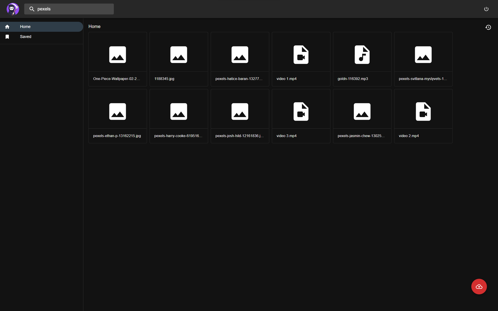
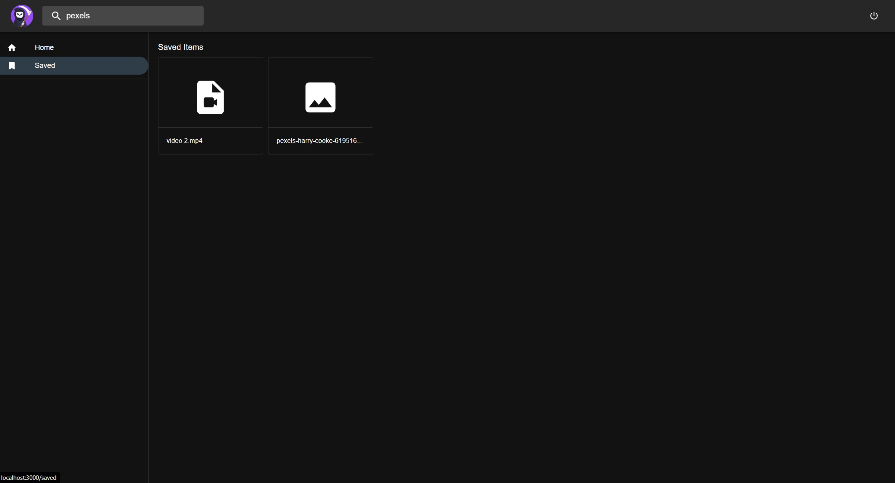
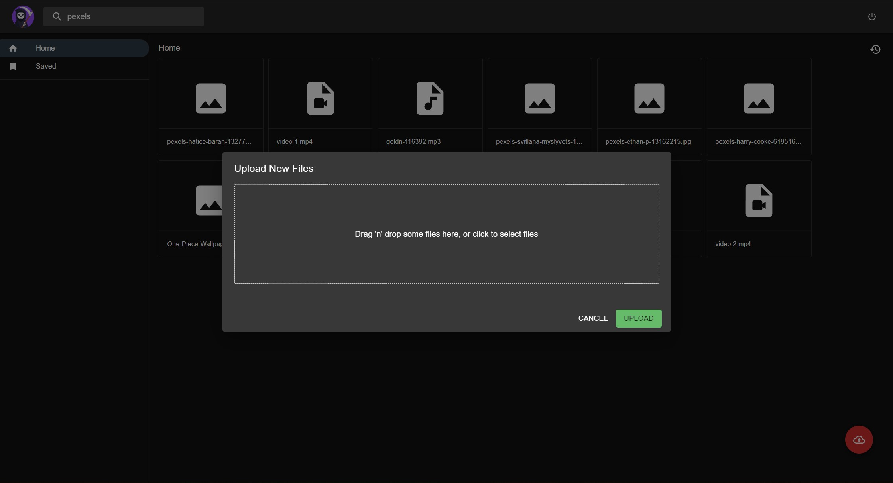
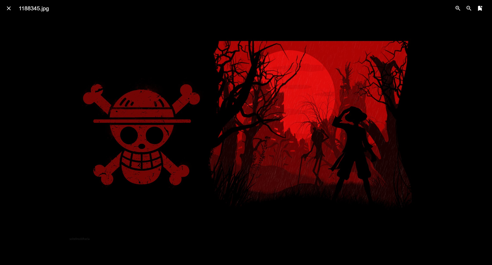
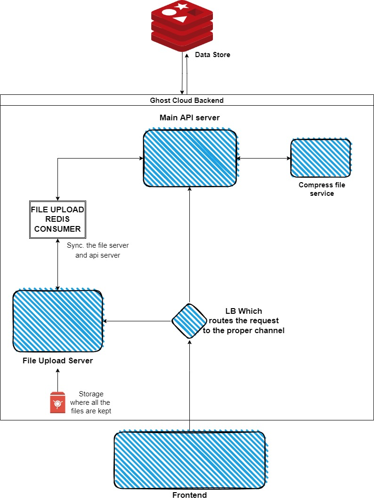

# Ghost Cloud | Redis Hackathon Submission

## Description

Ghost Cloud is an online platform for sharing files, and its a cloud-first microservices application. Once someone uploads a file it becomes publicly available in the platform and other persons can also view and save it. With the help of redis, tasks like file compression and uploading are completely asynchronous and Event Driven for the user.

The application consists of 5-tier microservices. That are performing various tasks.

This Project is using the following features of Redis

- Storing Data in database with the help of `JSONModels` ✅
- Background Tasks like File compresion are using `Pub/Sub features` ✅
- Syncing different web servers by using redis as a `message broker` ✅

## Screenshots

| Home Page                                 | Save File Page                                                     |
| ----------------------------------------- | ------------------------------------------------------------------ |
|       |           |

---

| Upload File                                                        | View File                                 |
| ------------------------------------------------------------------ | ----------------------------------------- |
|                     |       |

# Overview video

Here's a short video that explains the project and how it uses Redis:

[](https://www.youtube.com/watch?v=Xd8Kx3YMjZE)

## Architecture

**Ghost Cloud** is composed of 4 microservices and a frontend which connects everything together.



## How it works

### How the data is stored:

- There are different ways, in which the data is been saved in the system.

  - In Database Models

    Using redis-om python client to create models.

    > File Model

    ```python
    class File(JsonModel):
        '''
        This model represents a single file
        Operations like searching are performed using this model
        '''

        # name of the file
        name: str = Field(index=True, full_text_search=True)

        # content type of the file
        type: str

        # file size in bytes
        size: int

        # upload id, this id connects this file object
        # with another JSON model where more information
        # of the file is available.
        upload_id: str

        # tells whether file is uploaded, compressing, or compressed
        status: str
    ```

    > UploadFile Model

    ```python
    class FileUpload(HashModel):
        '''
        This model represents a customer
        '''

        # name of the file
        name: str
        
        # content type of the file
        type: str
        
        # file size in bytes
        size: int

        # location of the file on the system
        upload_path: str

    ```

    To save an instance of a Model the following way is used.

    > To save a file sent via FastAPI request.

    ```python
    @app.put("/files/upload/")
    async def upload_file(product: UploadFile):
        ...
        file_upload = FileUpload(
            name=file.filename,
            type=file.content_type,
            size=Path(upload_path).stat().st_size,
            upload_path=upload_path,
        )
        file_upload.save()
        ...
    ```

  - Sync the data between File Upload and API server

    Using instance of data models itself, we can construct the payload.

    ```python
    @app.put("/files/upload/")
    async def upload_file(file: UploadFile):
        ...
        # connect with api server via redis pub/sub
        data = {
            "name": file_upload.name,
            "type": file_upload.type,
            "size": file_upload.size,
            "upload_id": file_upload.pk,
            "status": "uploaded"
        }
        redis.publish("file_uploaded", json.dumps(data))
        ...
    ```

### How the data is accessed:

- There are different ways, in which the data can be accessed in the system.

  - From Database Models

    > This is how to access all the products in a system, and return as FastAPI Response.

    ```python
    @app.get("/files/")
    async def list_files():
        return [serialize_files(pk) for pk in File.all_pks()]
    ```

  - Revieving data from other service using Pub/Sub

    ```python
    def file_uploaded(data: dict):
        """
        Updates the API server once the file is uploaded
        successfully on the file upload server.
        """
        print("saving:", data)
        ...

    def upload_event_listener():
        """
        Listens to the events emitted on file_uploaded
        channel and synchronises servers 
        """
        p = redis.pubsub()
        p.subscribe("file_uploaded")

        while True:
            message = p.get_message()

            if message and not message['data'] == 1:
                data = json.loads(message['data'])
                file_uploaded(data)

    ```

### Performance Benchmarks

As compared to the previous case where GCP was using **Memorystore (redis)**, having a lot of limitations and constraints, this project is using **Redis Cloud**.

Redis Cloud provides customers real-time performance with linear scaling to **hundreds of millions of operations per second** while providing **local latency** in a global Active-Active deployment with **99.999%** uptime.

## How to run it locally?

**Step 1.** Start the Redis Stack docker container

```sh
$ docker run -d --name redis-stack -p 6379:6379 redis/redis-stack:latest
```

**Step 2.** Clone the repository

```sh
$ git clone git@github.com:ankit-brijwasi/ghost-cloud.git
$ cd ghost-cloud
$ docker compose up --build
```

**NOTE:** Wait for the `frontend` container to start serving

Now, open [http://localhost:3000/](http://localhost:3000/) in browser.

### Prerequisites

- Git
- Docker & docker compose
- A redis cloud account (optionally)

---

## More Information about Redis Stack

Here some resources to help you quickly get started using Redis Stack. If you still have questions, feel free to ask them in the [Redis Discord](https://discord.gg/redis) or on [Twitter](https://twitter.com/redisinc).

### Getting Started

1. Sign up for a [free Redis Cloud account using this link](https://redis.info/try-free-dev-to) and use the [Redis Stack database in the cloud](https://developer.redis.com/create/rediscloud).
1. Based on the language/framework you want to use, you will find the following client libraries:
   - [Redis OM .NET (C#)](https://github.com/redis/redis-om-dotnet)
     - Watch this [getting started video](https://www.youtube.com/watch?v=ZHPXKrJCYNA)
     - Follow this [getting started guide](https://redis.io/docs/stack/get-started/tutorials/stack-dotnet/)
   - [Redis OM Node (JS)](https://github.com/redis/redis-om-node)
     - Watch this [getting started video](https://www.youtube.com/watch?v=KUfufrwpBkM)
     - Follow this [getting started guide](https://redis.io/docs/stack/get-started/tutorials/stack-node/)
   - [Redis OM Python](https://github.com/redis/redis-om-python)
     - Watch this [getting started video](https://www.youtube.com/watch?v=PPT1FElAS84)
     - Follow this [getting started guide](https://redis.io/docs/stack/get-started/tutorials/stack-python/)
   - [Redis OM Spring (Java)](https://github.com/redis/redis-om-spring)
     - Watch this [getting started video](https://www.youtube.com/watch?v=YhQX8pHy3hk)
     - Follow this [getting started guide](https://redis.io/docs/stack/get-started/tutorials/stack-spring/)

The above videos and guides should be enough to get you started in your desired language/framework. From there you can expand and develop your app. Use the resources below to help guide you further:

1. [Developer Hub](https://redis.info/devhub) - The main developer page for Redis, where you can find information on building using Redis with sample projects, guides, and tutorials.
1. [Redis Stack getting started page](https://redis.io/docs/stack/) - Lists all the Redis Stack features. From there you can find relevant docs and tutorials for all the capabilities of Redis Stack.
1. [Redis Rediscover](https://redis.com/rediscover/) - Provides use-cases for Redis as well as real-world examples and educational material
1. [RedisInsight - Desktop GUI tool](https://redis.info/redisinsight) - Use this to connect to Redis to visually see the data. It also has a CLI inside it that lets you send Redis CLI commands. It also has a profiler so you can see commands that are run on your Redis instance in real-time
1. Youtube Videos
   - [Official Redis Youtube channel](https://redis.info/youtube)
   - [Redis Stack videos](https://www.youtube.com/watch?v=LaiQFZ5bXaM&list=PL83Wfqi-zYZFIQyTMUU6X7rPW2kVV-Ppb) - Help you get started modeling data, using Redis OM, and exploring Redis Stack
   - [Redis Stack Real-Time Stock App](https://www.youtube.com/watch?v=mUNFvyrsl8Q) from Ahmad Bazzi
   - [Build a Fullstack Next.js app](https://www.youtube.com/watch?v=DOIWQddRD5M) with Fireship.io
   - [Microservices with Redis Course](https://www.youtube.com/watch?v=Cy9fAvsXGZA) by Scalable Scripts on freeCodeCamp

---

Happy Coding

Cheers